# RevereseApp instuctions

## Load mesh

In the top left corner there is the button **Load mesh**. When you clicked on it you will get new window opened where you can select your file you want to open.

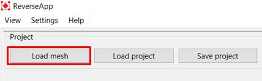

After you selected your file, there will pop up one new window where you will be supposed to select a measurement unit (millimeters or meters). Also, there will be shown expansion of your model in each of directions. An example is shown below.

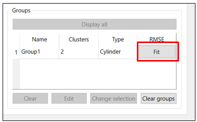

When you click on OK button in the Model units windows, the window will disapear and the model will be shown.

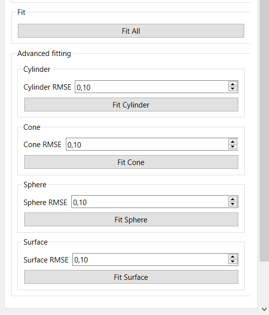

## Clustering

In the top left corner, just below the Load mesh button, there is the tab **Fitting** and inside it is the part you will use for clustering.

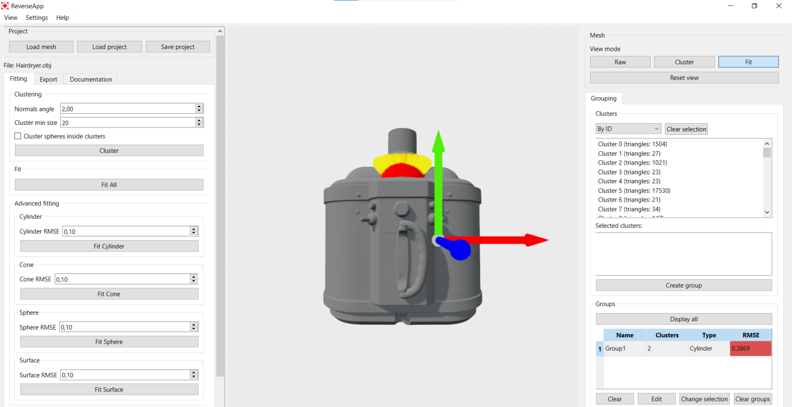

As you can see on the previous image, there are two parameters that affects you clustering. The first one, **Normals angle**, determines how two triangles would be obeserved. It is a thershold value that determines whether or not two triangles will finish in the same cluster. For example, if angle is set as on the image, which is 2 degrees, then if normal angles of two neighboring triangles are constructing angle that is less than the **Normals angle**, they will finish in the same cluster.

The second parameter is **Cluster min size** and it purpose is to eliminate clusters whose number of polygons is less, they are considered as a noise. There is the checkbox for **Cluster spheres inside clusters**, which will detect spherical sub-regions inside clusters and split them into separate clusters.

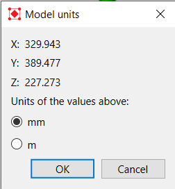

As you can see from the previous image, you got your model clusterised and now you can make preview of your model. Then can desided whether you want to accept or discard this clustering. If you are not satisfied with clustering, you can click on the **Discard** button below **Cluster**button in the same Clustering block on the left. If you are satisfied with clustering or maybe there are a few clusters that you would like to be clustered in the different way, you can click on the **Accept**button and you can recluster them separately. Reclustering is necessary when you have some clusters that you would like to see in a few clusters, then it can be selected by combination **CTRL + Left mouse click** and selected cluster will change color, then, change the clustering parameters and click on **Cluster**button and only selected cluster will be reclusted.

### Reclustering

On the following image is shown an example where reclustering is necessary. The orange cluster is selected one by combination **CTRL + Left mouse click**.

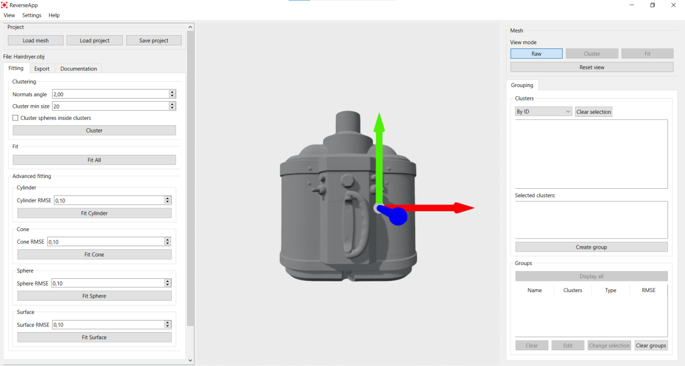

The problem with this cluster is that the flat and curved surfaces are grouped into the same cluster, although the curved surface more closely belongs to the cone surface. So, the idea is to recluster that part with different **Normals angle**.

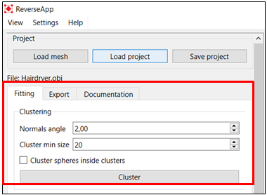

## Grouping

Now, it is time to select one or more clusters to make a group. It is done by picking clusters by combination **CTRL + Left mouse click**and after all wanted clusters are selected, there is the **Create group** button on the central-right side of the application.

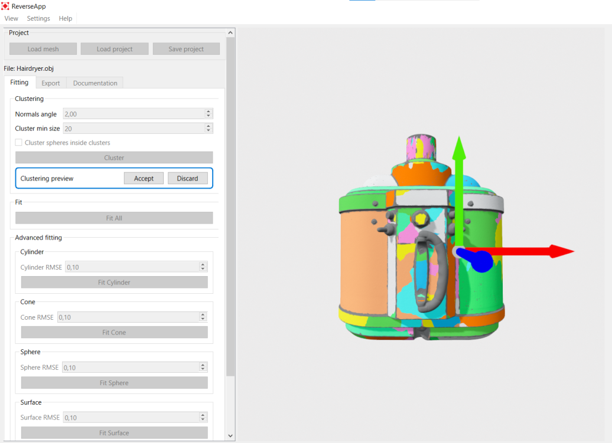

Also, there can be noticed the list of all clusters, which can be selected there from the list without combination of **CTRL + Left mouse click**. As can be seen, two clusters are selected in the list just above

the **Create group**button, in our case, those are two big clusters in the second cylinder from the top (blue circle), when some clusters are selected they get that orange color. When **Create group**is pressed, the new window, **Create group** will pop up.

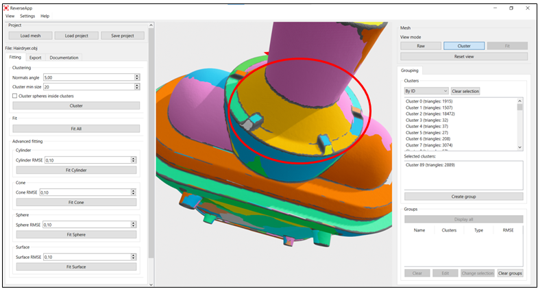

In this window, the selected group can be named, if there is no need for specific name, it will get default name. There can be chosen wanted primitive type: Undefined, Cylinder, Sphere, Cone, Surface.

## Fitting

After the group is created, it will be shown in the Groups block in the bottom right corner of the application window, in the list of all groups. In our case, we kept default group name, it consists of two clusters, selected primitive type is cylinder and there is one more column RMSE, which is not calculated at the moment because we have not fit anything on our group.

The following procedure is to fit the primitive onto the selected group. That can be done in the three ways. The easiest one is to click on the **Fit**button in the groups block in the bottom right corner.

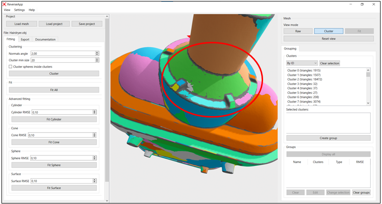

Other two options are on the left side of the application window, in the Fitting tab in the Fit block and Advanced fitting. In the Fit block there is the **Fit all**button, which will fit each existing group with the selected primitive type, for example, if there are three groups, one with primitive type cone, second with primitive type cylinder and third one with sphere, this button will perform fitting of a cone onto the first group, cylinder onto the second one and sphere onto third one. In the Advanced fitting, there are buttons **Fit cylinder, Fit cone, Fit sphere, Fit surface**, and the procedure for fitting is to select group you want to fit and click on the appropriate button (Note: if primitive type of the group is not Undefined, then fit will be performed only if the selected fit button corresponds to the primitive).

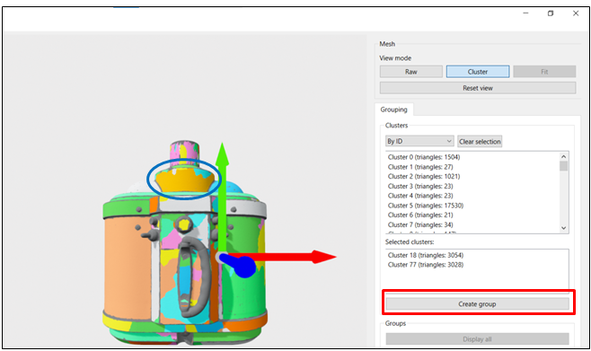

The result of the fitting on the selected clusters is shown below.

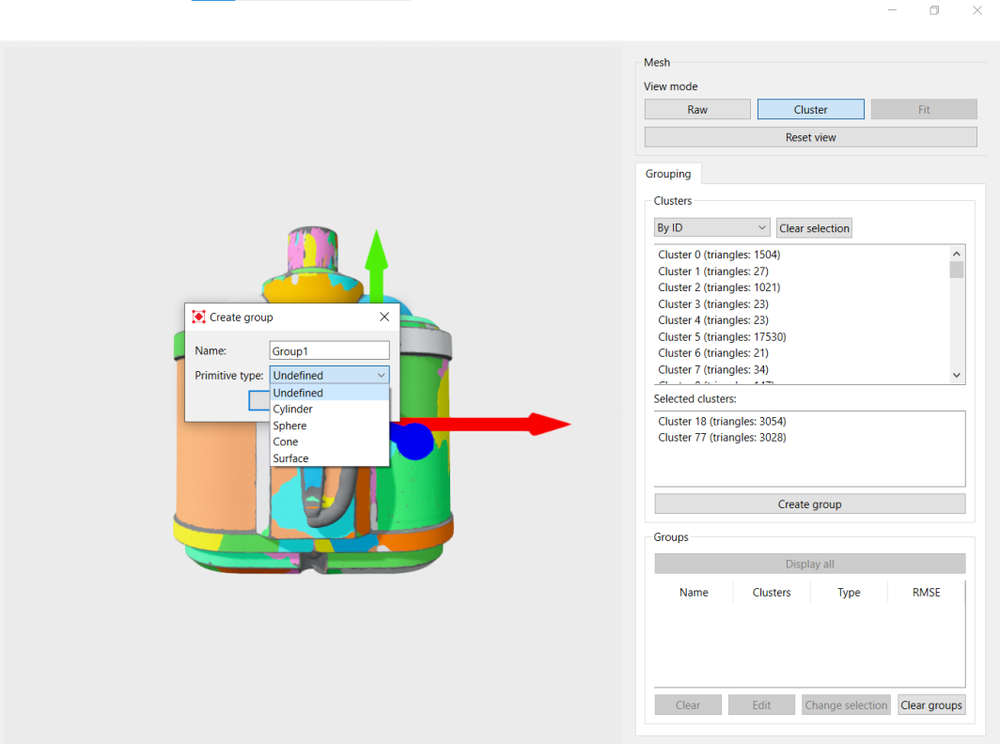

So, the result is presented as a combination of the selected clusters, virtual object (in this case cylinder) and wireframe around the virtual object. The score is expressed as a root mean squared error (RMSE) in the Groups block, where the result is highlighted red or green depending whether your result is below or above the selected RMSE, respectively. The selected RMSE is on the left side of the window, in the block Advanced fitting.

There is an option to turn off wireframe or virtual object through menu bar. In the View menu, there are three checkboxes, for coordinate axes, wireframe and virtual object.

